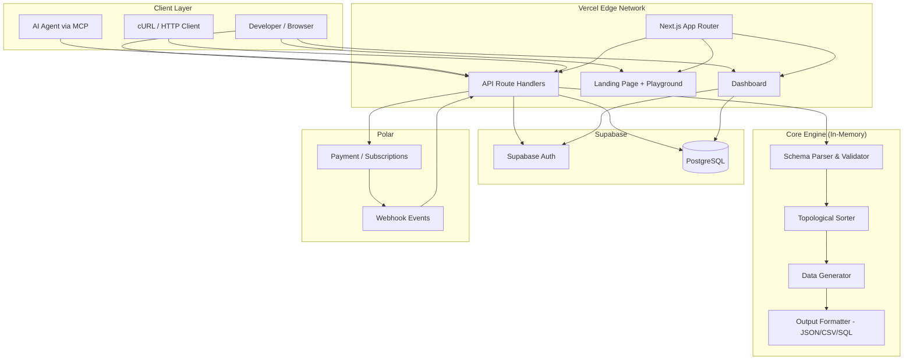

# PRD — MockHero

## 1. Overview

### Product Summary

**MockHero** — "Send a schema, get back realistic, relational fake data that looks real."

MockHero is an API-first synthetic test data service built for developers and AI coding agents. A developer or agent sends a POST request with a JSON schema defining tables, field types, and relationships. MockHero generates realistic, locale-aware data with correct foreign key references between tables and returns it as JSON, CSV, or SQL INSERT statements. The same seed always produces the same output for deterministic testing. An MCP server enables AI coding agents (Cursor, Claude Code, Copilot) to generate test data natively without the developer leaving their IDE.

### Objective

This PRD covers the MockHero MVP as defined in `docs/product-vision.md` § Product Strategy → MVP Definition. The scope is everything necessary for a developer to experience the magic moment — sending a multi-table schema and receiving production-quality relational data in under a second — and begin using MockHero in their daily workflow.

Specifically, this document blueprints:
- The data generation API (POST /api/v1/generate) with 30+ field types and relational engine
- Schema detection endpoint (POST /api/v1/schema/detect) — deferred to post-MVP but spec'd here
- Agent discovery endpoint (GET /api/v1/types) and health check (GET /api/v1/health)
- Supabase Auth integration with API key management
- Usage tracking and tier-based rate limiting
- Landing page with live playground
- Minimal dashboard (API key display, usage stats)
- MCP server for AI agent integration
- Polar payment integration for Pro ($29/mo) and Scale ($79/mo) tiers

### Market Differentiation

MockHero is the only API-first test data service designed for the AI coding era. Existing tools — Faker libraries, Mockaroo, manual seed scripts — were built for a world where developers manually configured test data. MockHero is built for a world where AI agents do it automatically. The technical implementation must deliver three capabilities no competitor offers: (1) relational data generation with topological sorting, foreign key resolution, and distribution-aware references across multiple tables in a single request; (2) locale depth with 500+ weighted names per locale, real city/postal code combinations, and correctly formatted phone numbers for 5 locales; (3) an MCP server that puts MockHero inside the AI agent's toolkit so the tool finds the developer, not the other way around.

### Magic Moment

A developer sends a multi-table schema with foreign key references — users, products, orders, reviews — and gets back 500+ records across 4 related tables in under a second. Every order references a real user ID. Every review references a real product. Names are locale-appropriate ("Maximilian Bergmann," not "John Doe"). Phone numbers use valid German formats. Email addresses look professional. The data that used to take 2 hours of seed script writing happened in 200ms with one API call.

For this moment to work, the implementation must ensure:
- Schema parsing accepts the schema and validates relationships before generation
- Topological sort resolves table dependencies (generates users before orders)
- Ref fields resolve to real IDs from already-generated parent tables
- Response time stays under 1 second for up to 5 tables and 1,000 total records
- Output quality is visually indistinguishable from real data at a glance

### Success Criteria

| Criterion | Target | Measurement |
|-----------|--------|-------------|
| Time to magic moment (signup → first successful multi-table generate) | < 60 seconds | Analytics: time from account creation to first 2+ table API call |
| API response time (p95, up to 1,000 records) | < 1,000ms | Server-side timing logs |
| API response time (p95, up to 100 records) | < 200ms | Server-side timing logs |
| Landing page LCP | < 2.0s | Lighthouse |
| Landing page TTI | < 3.0s | Lighthouse |
| All P0 features functional | 100% | Acceptance test suite |
| Foreign key integrity (no orphan references) | 100% | Automated validation in test suite |
| Free tier rate limiting enforced | 100% | Integration tests |
| MCP server installable and functional | Works with Cursor + Claude Code | Manual QA |

---

## 2. Technical Architecture

### Architecture Overview



### Chosen Stack

| Layer | Choice | Rationale |
|-------|--------|-----------|
| Frontend | Next.js (App Router) | React for landing page, docs, and dashboard. Deploys to Vercel with zero config. TypeScript end-to-end. Largest ecosystem and best AI coding tool support. |
| Backend | Next.js API Routes | All API endpoints are Next.js route handlers. Data generation engine is pure TypeScript running in serverless functions. No separate backend service. |
| Database | Supabase PostgreSQL | Manages API keys, usage logs, daily usage tracking, user accounts. Data generation is stateless and in-memory — Supabase handles persistent state for auth, billing, and rate limiting. |
| Auth | Supabase Auth | Email/password and GitHub OAuth for developer signups. API key generation and validation for programmatic API access. Integrated with the same Supabase instance. |
| Payments | Polar | Built for developer tools and SaaS subscriptions. Handles Pro ($29/mo) and Scale ($79/mo) tiers. Developer-friendly API. No Stripe complexity needed. |

### Stack Integration Guide

**Setup Order:**

1. **Supabase project** — Create project, note the project URL, anon key, and service role key. Run SQL migrations to create tables (api_keys, usage_logs, daily_usage, subscriptions). Enable GitHub OAuth in Supabase Auth dashboard.
2. **Next.js app** — `npx create-next-app@latest mockhero --typescript --tailwind --app --src-dir`. Install `@supabase/supabase-js` and `@supabase/ssr`.
3. **Supabase client setup** — Create browser client (`src/lib/supabase/client.ts`) and server client (`src/lib/supabase/server.ts`) using `@supabase/ssr` helpers for cookie-based session management in Next.js App Router.
4. **Polar account** — Create organization on Polar, set up products for Pro and Scale tiers, configure webhook endpoint URL (`/api/webhooks/polar`), note the webhook secret and API key.
5. **Vercel deployment** — Connect GitHub repo, set environment variables, deploy. Automatic preview deployments on PRs.

**Key Integration Patterns:**

- **Supabase Auth + Next.js App Router:** Use `@supabase/ssr` to create a server-side Supabase client in route handlers and server components. Middleware at `src/middleware.ts` refreshes auth sessions on every request. The browser client is created with `createBrowserClient()` for client components.
- **API Key validation in route handlers:** API routes extract the `x-api-key` header, look up the key in the `api_keys` table via Supabase service role client (bypasses RLS), and check the user's tier limits. This happens in shared middleware (`src/lib/api/middleware.ts`).
- **Polar webhooks:** Polar sends subscription lifecycle events to `/api/webhooks/polar`. The handler verifies the webhook signature, then updates the user's `tier` in the `subscriptions` table.

**Common Gotchas:**

- Supabase's `anon` key is public and safe for client-side use (RLS enforced). The `service_role` key bypasses RLS and must only be used server-side in route handlers, never exposed to the client.
- Next.js API routes in App Router use the `route.ts` convention, not `api/[...].ts` from Pages Router.
- Polar webhooks must be verified using the webhook secret before processing. Use the `@polar-sh/sdk` package's built-in verification.
- The data generation engine must not import Supabase or any I/O module — it must be pure TypeScript functions for testability and performance.

**Required Environment Variables:**

```bash
# Supabase
NEXT_PUBLIC_SUPABASE_URL=https://xxx.supabase.co
NEXT_PUBLIC_SUPABASE_ANON_KEY=eyJ...
SUPABASE_SERVICE_ROLE_KEY=eyJ...

# Polar
POLAR_API_KEY=polar_...
POLAR_WEBHOOK_SECRET=whsec_...
POLAR_ORGANIZATION_ID=org_...

# App
NEXT_PUBLIC_APP_URL=https://mockhero.dev
```

### Repository Structure

```
mockhero/
├── src/
│   ├── app/                           # Next.js App Router
│   │   ├── layout.tsx                 # Root layout with fonts, metadata
│   │   ├── page.tsx                   # Landing page
│   │   ├── (auth)/
│   │   │   ├── login/page.tsx         # Login page
│   │   │   ├── signup/page.tsx        # Signup page
│   │   │   └── callback/route.ts      # OAuth callback handler
│   │   ├── dashboard/
│   │   │   ├── layout.tsx             # Dashboard layout with nav
│   │   │   ├── page.tsx               # API key + usage overview
│   │   │   └── settings/page.tsx      # Account settings
│   │   └── api/
│   │       ├── v1/
│   │       │   ├── generate/route.ts  # POST /api/v1/generate
│   │       │   ├── types/route.ts     # GET /api/v1/types
│   │       │   ├── health/route.ts    # GET /api/v1/health
│   │       │   └── schema/
│   │       │       └── detect/route.ts # POST /api/v1/schema/detect
│   │       └── webhooks/
│   │           └── polar/route.ts     # Polar webhook handler
│   ├── components/
│   │   ├── ui/                        # Design system primitives
│   │   │   ├── button.tsx
│   │   │   ├── input.tsx
│   │   │   ├── card.tsx
│   │   │   ├── badge.tsx
│   │   │   ├── code-block.tsx
│   │   │   ├── modal.tsx
│   │   │   ├── tabs.tsx
│   │   │   ├── toast.tsx
│   │   │   └── skeleton.tsx
│   │   ├── landing/                   # Landing page sections
│   │   │   ├── hero.tsx
│   │   │   ├── playground.tsx
│   │   │   ├── features.tsx
│   │   │   ├── code-examples.tsx
│   │   │   ├── pricing.tsx
│   │   │   └── footer.tsx
│   │   └── dashboard/                 # Dashboard components
│   │       ├── api-key-card.tsx
│   │       ├── usage-chart.tsx
│   │       └── tier-info.tsx
│   ├── lib/
│   │   ├── supabase/
│   │   │   ├── client.ts              # Browser Supabase client
│   │   │   ├── server.ts              # Server Supabase client
│   │   │   └── admin.ts              # Service role client (API routes only)
│   │   ├── api/
│   │   │   ├── middleware.ts          # API key validation, rate limiting
│   │   │   ├── errors.ts             # Standardized error responses
│   │   │   └── rate-limiter.ts        # Tier-based rate limiting logic
│   │   ├── engine/                    # Core data generation engine (pure TS)
│   │   │   ├── generator.ts           # Main generate() function
│   │   │   ├── schema-parser.ts       # Schema validation and parsing
│   │   │   ├── topological-sort.ts    # Dependency resolution
│   │   │   ├── field-generators/      # One file per field type category
│   │   │   │   ├── identity.ts        # first_name, last_name, email, etc.
│   │   │   │   ├── location.ts        # city, country, address, etc.
│   │   │   │   ├── business.ts        # company_name, product_name, etc.
│   │   │   │   ├── temporal.ts        # datetime, date
│   │   │   │   ├── technical.ts       # uuid, ip_address, url, etc.
│   │   │   │   ├── content.ts         # sentence, paragraph, title, etc.
│   │   │   │   └── logic.ts           # boolean, enum, ref, sequence, etc.
│   │   │   ├── formatters/
│   │   │   │   ├── json-formatter.ts
│   │   │   │   ├── csv-formatter.ts
│   │   │   │   └── sql-formatter.ts   # Postgres, MySQL, SQLite dialects
│   │   │   ├── locale-data/           # Static data files per locale
│   │   │   │   ├── en.ts
│   │   │   │   ├── de.ts
│   │   │   │   ├── fr.ts
│   │   │   │   ├── es.ts
│   │   │   │   └── hr.ts
│   │   │   ├── prng.ts                # Seeded pseudo-random number generator
│   │   │   └── types.ts              # TypeScript types for schema, config, output
│   │   ├── polar/
│   │   │   ├── client.ts              # Polar SDK client
│   │   │   └── webhooks.ts            # Webhook verification + handlers
│   │   └── utils/
│   │       ├── cn.ts                  # Tailwind class merge utility
│   │       └── constants.ts           # Tier limits, field type registry
│   ├── hooks/
│   │   ├── use-auth.ts                # Auth state hook
│   │   └── use-api-key.ts             # API key management hook
│   └── middleware.ts                  # Next.js middleware (session refresh)
├── mcp-server/                        # MCP server package (separate npm package)
│   ├── package.json
│   ├── tsconfig.json
│   ├── src/
│   │   └── index.ts                   # MCP server with generate + types tools
│   └── README.md
├── supabase/
│   └── migrations/                    # SQL migration files
│       └── 001_initial_schema.sql
├── public/
│   ├── og-image.png
│   └── favicon.ico
├── tailwind.config.ts
├── next.config.ts
├── tsconfig.json
├── package.json
└── .env.local                         # Local environment variables (git-ignored)
```

### Infrastructure & Deployment

**Hosting:** Vercel (Pro plan recommended for production, Hobby for early development)
- Automatic deployments from `main` branch
- Preview deployments for every PR
- Edge network for global low-latency responses
- Serverless functions for API routes (default 10s timeout, increase to 30s for large generation requests)

**Database:** Supabase Free tier (sufficient for <500 users)
- 500MB database storage
- 50,000 monthly active users for auth
- 2GB bandwidth
- Upgrade to Pro ($25/mo) when approaching limits

**Payments:** Polar (no infrastructure cost — Polar hosts everything)

**CI/CD:**
- GitHub Actions for linting, type checking, and tests on every PR
- Vercel handles deployment (no custom CI/CD pipeline needed for deploys)
- Run `tsc --noEmit`, `eslint .`, and `vitest` in CI

**Environment Variables (Vercel):**
All variables from the `.env.local` template above must be set in Vercel project settings. Use separate Supabase projects for preview and production environments.

### Security Considerations

**Authentication Flow:**
1. Web signup/login: Supabase Auth (email/password or GitHub OAuth) → session stored in HTTP-only cookies via `@supabase/ssr`
2. API access: API key passed in `x-api-key` header → validated against `api_keys` table → user and tier resolved

**API Key Security:**
- Keys are generated as `mh_` + 32-byte random hex string (e.g., `mh_a1b2c3d4...`)
- Keys are hashed with SHA-256 before storage; the raw key is shown once at creation and never again
- Keys can be revoked (soft delete) from the dashboard
- Each user gets one active key; regeneration revokes the old key

**Input Validation:**
- All API input validated with `zod` schemas before processing
- Schema field count capped at 50 fields per table, 20 tables per request
- Record count capped at tier limits (Free: 100/request, Pro: 10,000/request, Scale: 50,000/request)
- Request body size limited to 1MB

**Rate Limiting:**
- Implemented at the application level using the `daily_usage` table
- Free: 1,000 records/day, 100 per request, 10 requests/minute
- Pro: 100,000 records/day, 10,000 per request, 60 requests/minute
- Scale: 1,000,000 records/day, 50,000 per request, 120 requests/minute
- Per-minute rate limiting uses an in-memory sliding window (resets on function cold start, acceptable for MVP)

**Data Protection:**
- No user-submitted data is stored — generation is entirely stateless
- Usage logs store only metadata (record count, table count, timestamp), not generated content
- Supabase RLS policies ensure users can only access their own data
- Service role key is only used in server-side route handlers

### Cost Estimate

| Service | Free Tier Limit | Monthly Cost (< 1,000 users) |
|---------|----------------|------------------------------|
| Vercel | Hobby (free for personal) | $0 – $20 (Pro if needed) |
| Supabase | 500MB DB, 50K MAU | $0 – $25 (Pro if >500 users) |
| Polar | No platform fee (5% + Stripe fees on transactions) | $0 base + ~5% of revenue |
| Domain (mockhero.dev) | — | ~$12/year ($1/mo) |
| **Total** | | **$1 – $46/mo** |

At <500 users and <$400 MRR, infrastructure cost is effectively $0-1/month (domain only). Supabase and Vercel free tiers cover the load.

---

## 3. Data Model

### Entity Definitions

```sql
-- Enable UUID extension
CREATE EXTENSION IF NOT EXISTS "pgcrypto";

-- ============================================================
-- users: Managed by Supabase Auth (auth.users)
-- This table extends the auth.users table with app-specific data
-- ============================================================
CREATE TABLE public.profiles (
  id UUID PRIMARY KEY REFERENCES auth.users(id) ON DELETE CASCADE,
  display_name VARCHAR(255),
  avatar_url TEXT,
  tier VARCHAR(20) NOT NULL DEFAULT 'free'
    CHECK (tier IN ('free', 'pro', 'scale')),
  created_at TIMESTAMPTZ NOT NULL DEFAULT NOW(),
  updated_at TIMESTAMPTZ NOT NULL DEFAULT NOW()
);

-- ============================================================
-- api_keys: One active key per user for API authentication
-- ============================================================
CREATE TABLE public.api_keys (
  id UUID PRIMARY KEY DEFAULT gen_random_uuid(),
  user_id UUID NOT NULL REFERENCES public.profiles(id) ON DELETE CASCADE,
  key_hash VARCHAR(64) NOT NULL,          -- SHA-256 hash of the raw key
  key_prefix VARCHAR(12) NOT NULL,        -- First 12 chars for identification (e.g., "mh_a1b2c3d4")
  is_active BOOLEAN NOT NULL DEFAULT TRUE,
  created_at TIMESTAMPTZ NOT NULL DEFAULT NOW(),
  revoked_at TIMESTAMPTZ,
  UNIQUE (key_hash)
);

-- ============================================================
-- usage_logs: Individual API request log for analytics
-- ============================================================
CREATE TABLE public.usage_logs (
  id UUID PRIMARY KEY DEFAULT gen_random_uuid(),
  user_id UUID NOT NULL REFERENCES public.profiles(id) ON DELETE CASCADE,
  api_key_id UUID NOT NULL REFERENCES public.api_keys(id) ON DELETE CASCADE,
  records_generated INTEGER NOT NULL,
  tables_count INTEGER NOT NULL DEFAULT 1,
  format VARCHAR(10) NOT NULL DEFAULT 'json'
    CHECK (format IN ('json', 'csv', 'sql')),
  locale VARCHAR(5) DEFAULT 'en',
  response_time_ms INTEGER NOT NULL,      -- Server-side generation + formatting time
  schema_hash VARCHAR(64),                -- SHA-256 of the request schema for caching analytics
  has_relations BOOLEAN NOT NULL DEFAULT FALSE,
  user_agent TEXT,                         -- Track MCP vs direct API usage
  created_at TIMESTAMPTZ NOT NULL DEFAULT NOW()
);

-- ============================================================
-- daily_usage: Aggregated daily record count per user for rate limiting
-- ============================================================
CREATE TABLE public.daily_usage (
  id UUID PRIMARY KEY DEFAULT gen_random_uuid(),
  user_id UUID NOT NULL REFERENCES public.profiles(id) ON DELETE CASCADE,
  date DATE NOT NULL DEFAULT CURRENT_DATE,
  records_used INTEGER NOT NULL DEFAULT 0,
  requests_count INTEGER NOT NULL DEFAULT 0,
  UNIQUE (user_id, date)
);

-- ============================================================
-- subscriptions: Polar subscription state synced via webhooks
-- ============================================================
CREATE TABLE public.subscriptions (
  id UUID PRIMARY KEY DEFAULT gen_random_uuid(),
  user_id UUID NOT NULL REFERENCES public.profiles(id) ON DELETE CASCADE,
  polar_subscription_id VARCHAR(255) UNIQUE NOT NULL,
  polar_customer_id VARCHAR(255) NOT NULL,
  product_name VARCHAR(50) NOT NULL,      -- 'pro' or 'scale'
  status VARCHAR(50) NOT NULL DEFAULT 'active'
    CHECK (status IN ('active', 'canceled', 'past_due', 'incomplete')),
  current_period_start TIMESTAMPTZ NOT NULL,
  current_period_end TIMESTAMPTZ NOT NULL,
  cancel_at_period_end BOOLEAN NOT NULL DEFAULT FALSE,
  created_at TIMESTAMPTZ NOT NULL DEFAULT NOW(),
  updated_at TIMESTAMPTZ NOT NULL DEFAULT NOW()
);

-- ============================================================
-- RLS Policies
-- ============================================================
ALTER TABLE public.profiles ENABLE ROW LEVEL SECURITY;
ALTER TABLE public.api_keys ENABLE ROW LEVEL SECURITY;
ALTER TABLE public.usage_logs ENABLE ROW LEVEL SECURITY;
ALTER TABLE public.daily_usage ENABLE ROW LEVEL SECURITY;
ALTER TABLE public.subscriptions ENABLE ROW LEVEL SECURITY;

-- Profiles: users can read/update their own profile
CREATE POLICY profiles_select ON public.profiles FOR SELECT USING (auth.uid() = id);
CREATE POLICY profiles_update ON public.profiles FOR UPDATE USING (auth.uid() = id);

-- API Keys: users can manage their own keys
CREATE POLICY api_keys_select ON public.api_keys FOR SELECT USING (auth.uid() = user_id);
CREATE POLICY api_keys_insert ON public.api_keys FOR INSERT WITH CHECK (auth.uid() = user_id);
CREATE POLICY api_keys_update ON public.api_keys FOR UPDATE USING (auth.uid() = user_id);

-- Usage logs: users can read their own logs
CREATE POLICY usage_logs_select ON public.usage_logs FOR SELECT USING (auth.uid() = user_id);

-- Daily usage: users can read their own daily usage
CREATE POLICY daily_usage_select ON public.daily_usage FOR SELECT USING (auth.uid() = user_id);

-- Subscriptions: users can read their own subscription
CREATE POLICY subscriptions_select ON public.subscriptions FOR SELECT USING (auth.uid() = user_id);

-- ============================================================
-- Functions
-- ============================================================

-- Auto-create profile on signup
CREATE OR REPLACE FUNCTION public.handle_new_user()
RETURNS TRIGGER AS $$
BEGIN
  INSERT INTO public.profiles (id, display_name, avatar_url)
  VALUES (
    NEW.id,
    COALESCE(NEW.raw_user_meta_data ->> 'full_name', NEW.raw_user_meta_data ->> 'name', split_part(NEW.email, '@', 1)),
    NEW.raw_user_meta_data ->> 'avatar_url'
  );
  RETURN NEW;
END;
$$ LANGUAGE plpgsql SECURITY DEFINER;

CREATE TRIGGER on_auth_user_created
  AFTER INSERT ON auth.users
  FOR EACH ROW EXECUTE FUNCTION public.handle_new_user();

-- Update updated_at on profile changes
CREATE OR REPLACE FUNCTION public.update_updated_at()
RETURNS TRIGGER AS $$
BEGIN
  NEW.updated_at = NOW();
  RETURN NEW;
END;
$$ LANGUAGE plpgsql;

CREATE TRIGGER profiles_updated_at
  BEFORE UPDATE ON public.profiles
  FOR EACH ROW EXECUTE FUNCTION public.update_updated_at();

CREATE TRIGGER subscriptions_updated_at
  BEFORE UPDATE ON public.subscriptions
  FOR EACH ROW EXECUTE FUNCTION public.update_updated_at();
```

### Relationships

| Relationship | Type | From | To | Cascade |
|-------------|------|------|-----|---------|
| Profile → Auth User | 1:1 | `profiles.id` | `auth.users.id` | ON DELETE CASCADE |
| User → API Keys | 1:many | `api_keys.user_id` | `profiles.id` | ON DELETE CASCADE |
| User → Usage Logs | 1:many | `usage_logs.user_id` | `profiles.id` | ON DELETE CASCADE |
| API Key → Usage Logs | 1:many | `usage_logs.api_key_id` | `api_keys.id` | ON DELETE CASCADE |
| User → Daily Usage | 1:many | `daily_usage.user_id` | `profiles.id` | ON DELETE CASCADE |
| User → Subscriptions | 1:many | `subscriptions.user_id` | `profiles.id` | ON DELETE CASCADE |

### Indexes

```sql
-- API key lookup by hash (used on every API request for auth)
CREATE INDEX idx_api_keys_key_hash ON public.api_keys (key_hash) WHERE is_active = TRUE;

-- Daily usage lookup (used on every API request for rate limiting)
CREATE UNIQUE INDEX idx_daily_usage_user_date ON public.daily_usage (user_id, date);

-- Usage logs by user and date (dashboard queries)
CREATE INDEX idx_usage_logs_user_created ON public.usage_logs (user_id, created_at DESC);

-- Subscriptions by user (tier check on API requests)
CREATE INDEX idx_subscriptions_user_status ON public.subscriptions (user_id, status) WHERE status = 'active';

-- Subscriptions by Polar ID (webhook updates)
CREATE INDEX idx_subscriptions_polar_id ON public.subscriptions (polar_subscription_id);
```

**Index rationale:**
- `idx_api_keys_key_hash`: Every API request hashes the provided key and looks it up. Partial index on `is_active = TRUE` skips revoked keys.
- `idx_daily_usage_user_date`: Every API request checks and increments the daily record count. The unique constraint also serves as the index.
- `idx_usage_logs_user_created`: Dashboard displays recent usage sorted by time.
- `idx_subscriptions_user_status`: API middleware resolves user tier from active subscriptions.
- `idx_subscriptions_polar_id`: Polar webhooks update subscriptions by their Polar ID.

---

## 4. API Specification

### API Design Philosophy

**REST with JSON request/response.** All endpoints follow REST conventions. The API uses `x-api-key` header authentication (not Bearer tokens) because API keys are simpler for developers and AI agents to manage — no token refresh, no OAuth flow, just a static key in the header.

**Error Response Format (all endpoints):**

```json
{
  "error": {
    "code": "VALIDATION_ERROR",
    "message": "Human-readable description of what went wrong",
    "details": [
      {
        "field": "tables[0].fields[2].type",
        "message": "Unknown field type 'strig'. Did you mean 'string'? See GET /api/v1/types for supported types."
      }
    ]
  }
}
```

Error codes: `VALIDATION_ERROR` (400), `UNAUTHORIZED` (401), `RATE_LIMIT_EXCEEDED` (429), `INTERNAL_ERROR` (500), `SCHEMA_ERROR` (400), `DEPENDENCY_CYCLE` (400).

**Rate Limit Headers (all authenticated endpoints):**

```
X-RateLimit-Limit: 1000
X-RateLimit-Remaining: 847
X-RateLimit-Reset: 2026-03-19T00:00:00Z
X-RateLimit-Records-Limit: 1000
X-RateLimit-Records-Remaining: 847
```

### Endpoints

#### POST /api/v1/generate

The core endpoint. Accepts a schema definition and returns generated data.

```
POST /api/v1/generate
Auth: Required (x-api-key header)
Content-Type: application/json

Request Body:
{
  "tables": [
    {
      "name": "users",
      "count": 50,
      "fields": [
        { "name": "id", "type": "uuid" },
        { "name": "first_name", "type": "first_name" },
        { "name": "last_name", "type": "last_name" },
        { "name": "email", "type": "email" },
        { "name": "phone", "type": "phone" },
        { "name": "role", "type": "enum", "params": { "values": ["admin", "member", "viewer"], "weights": [5, 80, 15] } },
        { "name": "is_active", "type": "boolean", "params": { "probability": 0.85 } },
        { "name": "created_at", "type": "datetime", "params": { "min": "2024-01-01", "max": "2026-03-18" } }
      ]
    },
    {
      "name": "orders",
      "count": 200,
      "fields": [
        { "name": "id", "type": "uuid" },
        { "name": "user_id", "type": "ref", "params": { "table": "users", "field": "id", "distribution": "power_law" } },
        { "name": "total", "type": "decimal", "params": { "min": 9.99, "max": 499.99, "precision": 2 } },
        { "name": "status", "type": "enum", "params": { "values": ["pending", "shipped", "delivered", "canceled"], "weights": [15, 25, 50, 10] } },
        { "name": "order_number", "type": "sequence", "params": { "start": 1001, "prefix": "ORD-" } },
        { "name": "ordered_at", "type": "datetime", "params": { "min": "2024-06-01", "max": "2026-03-18" } }
      ]
    }
  ],
  "locale": "de",
  "format": "json",
  "seed": 42,
  "sql_dialect": "postgres"
}
```

**Request Parameters:**

| Field | Type | Required | Default | Description |
|-------|------|----------|---------|-------------|
| `tables` | array | Yes | — | Array of table definitions |
| `tables[].name` | string | Yes | — | Table name (alphanumeric + underscores) |
| `tables[].count` | integer | Yes | — | Number of records to generate (1–50,000 depending on tier) |
| `tables[].fields` | array | Yes | — | Array of field definitions |
| `tables[].fields[].name` | string | Yes | — | Column name |
| `tables[].fields[].type` | string | Yes | — | Field type (see GET /api/v1/types) |
| `tables[].fields[].params` | object | No | `{}` | Type-specific parameters |
| `tables[].fields[].nullable` | boolean | No | `false` | If true, ~15% of values will be null |
| `locale` | string | No | `"en"` | Locale code: en, de, fr, es, hr |
| `format` | string | No | `"json"` | Output format: json, csv, sql |
| `seed` | integer | No | random | Seed for deterministic output |
| `sql_dialect` | string | No | `"postgres"` | SQL dialect when format is sql: postgres, mysql, sqlite |

**Response 200 (format: json):**

```json
{
  "data": {
    "users": [
      {
        "id": "f47ac10b-58cc-4372-a567-0e02b2c3d479",
        "first_name": "Maximilian",
        "last_name": "Bergmann",
        "email": "maximilian.bergmann@outlook.de",
        "phone": "+49 30 12345678",
        "role": "member",
        "is_active": true,
        "created_at": "2025-04-12T09:34:21Z"
      }
    ],
    "orders": [
      {
        "id": "b5c7e9a2-1234-4abc-def0-123456789abc",
        "user_id": "f47ac10b-58cc-4372-a567-0e02b2c3d479",
        "total": 127.45,
        "status": "delivered",
        "order_number": "ORD-1001",
        "ordered_at": "2025-09-03T14:22:07Z"
      }
    ]
  },
  "meta": {
    "tables": 2,
    "total_records": 250,
    "records_per_table": { "users": 50, "orders": 200 },
    "locale": "de",
    "format": "json",
    "seed": 42,
    "generation_time_ms": 87
  }
}
```

**Response 200 (format: sql):**

```json
{
  "data": "CREATE TABLE users (\n  id UUID PRIMARY KEY,\n  first_name VARCHAR(255),\n  ...\n);\n\nINSERT INTO users (id, first_name, ...) VALUES\n  ('f47ac10b-...', 'Maximilian', ...),\n  ...;\n\nCREATE TABLE orders (...);...",
  "meta": { ... }
}
```

**Response 200 (format: csv):**

```json
{
  "data": {
    "users": "id,first_name,last_name,email,...\nf47ac10b-...,Maximilian,Bergmann,...",
    "orders": "id,user_id,total,...\nb5c7e9a2-...,f47ac10b-...,127.45,..."
  },
  "meta": { ... }
}
```

**Response 400:**
```json
{
  "error": {
    "code": "VALIDATION_ERROR",
    "message": "Invalid schema",
    "details": [{ "field": "tables[1].fields[0].type", "message": "Unknown field type 'strig'" }]
  }
}
```

**Response 401:**
```json
{ "error": { "code": "UNAUTHORIZED", "message": "Missing or invalid API key. Include your key in the x-api-key header." } }
```

**Response 429:**
```json
{
  "error": {
    "code": "RATE_LIMIT_EXCEEDED",
    "message": "Daily record limit exceeded. Free tier allows 1,000 records/day. Upgrade to Pro for 100,000.",
    "details": [{ "field": "daily_limit", "message": "Used 1,000 of 1,000 records today. Resets at midnight UTC." }]
  }
}
```

#### GET /api/v1/types

Returns all supported field types with descriptions and parameters. This is the agent discovery endpoint — AI agents call this to understand what field types are available before constructing a schema.

```
GET /api/v1/types
Auth: None required (public endpoint)

Response 200:
{
  "types": {
    "identity": [
      {
        "type": "first_name",
        "description": "Locale-aware first name, weighted by real frequency",
        "params": {},
        "example": "Maximilian"
      },
      {
        "type": "last_name",
        "description": "Locale-aware last name, weighted by real frequency",
        "params": {},
        "example": "Bergmann"
      },
      {
        "type": "full_name",
        "description": "Combined first and last name",
        "params": {},
        "example": "Maximilian Bergmann"
      },
      {
        "type": "email",
        "description": "Realistic email derived from name fields or random",
        "params": {},
        "example": "maximilian.bergmann@outlook.de"
      },
      {
        "type": "username",
        "description": "Username derived from name or random pattern",
        "params": {},
        "example": "mbergmann42"
      },
      {
        "type": "phone",
        "description": "Locale-formatted phone number",
        "params": {},
        "example": "+49 30 12345678"
      }
    ],
    "location": [
      {
        "type": "city",
        "description": "Real city name from locale",
        "params": {},
        "example": "Berlin"
      },
      {
        "type": "country",
        "description": "Country name",
        "params": {},
        "example": "Germany"
      },
      {
        "type": "postal_code",
        "description": "Locale-formatted postal code",
        "params": {},
        "example": "10117"
      },
      {
        "type": "address",
        "description": "Full street address with locale formatting",
        "params": {},
        "example": "Friedrichstra\u00dfe 42, 10117 Berlin"
      }
    ],
    "business": [
      {
        "type": "company_name",
        "description": "Realistic company name",
        "params": {},
        "example": "Bergmann Technologies GmbH"
      },
      {
        "type": "product_name",
        "description": "Product name with optional category",
        "params": { "category": "optional string: electronics, clothing, food, etc." },
        "example": "Wireless Bluetooth Headphones"
      },
      {
        "type": "rating",
        "description": "Numeric rating",
        "params": { "min": "number (default: 1)", "max": "number (default: 5)", "precision": "number (default: 1)" },
        "example": 4.5
      },
      {
        "type": "price",
        "description": "Realistic price with optional range",
        "params": { "min": "number (default: 0.99)", "max": "number (default: 999.99)", "precision": "number (default: 2)" },
        "example": 29.99
      }
    ],
    "temporal": [
      {
        "type": "datetime",
        "description": "ISO 8601 datetime",
        "params": { "min": "ISO date string (default: 1 year ago)", "max": "ISO date string (default: now)" },
        "example": "2025-09-03T14:22:07Z"
      },
      {
        "type": "date",
        "description": "ISO 8601 date (no time)",
        "params": { "min": "ISO date string", "max": "ISO date string" },
        "example": "2025-09-03"
      }
    ],
    "technical": [
      {
        "type": "uuid",
        "description": "UUID v4",
        "params": {},
        "example": "f47ac10b-58cc-4372-a567-0e02b2c3d479"
      },
      {
        "type": "id",
        "description": "Auto-incrementing integer ID",
        "params": { "start": "number (default: 1)" },
        "example": 1
      },
      {
        "type": "url",
        "description": "Realistic URL",
        "params": {},
        "example": "https://bergmann-tech.de/products/wireless-headphones"
      },
      {
        "type": "ip_address",
        "description": "IPv4 address",
        "params": { "version": "4 or 6 (default: 4)" },
        "example": "192.168.1.42"
      },
      {
        "type": "color_hex",
        "description": "Hex color code",
        "params": {},
        "example": "#6C5CE7"
      },
      {
        "type": "json",
        "description": "JSON string from a mini-schema",
        "params": { "schema": "object defining nested structure" },
        "example": "{\"key\": \"value\"}"
      }
    ],
    "content": [
      {
        "type": "sentence",
        "description": "Realistic sentence",
        "params": { "min_words": "number (default: 5)", "max_words": "number (default: 15)" },
        "example": "The system processed all pending transactions before midnight."
      },
      {
        "type": "paragraph",
        "description": "Multi-sentence paragraph",
        "params": { "min_sentences": "number (default: 2)", "max_sentences": "number (default: 5)" },
        "example": "..."
      },
      {
        "type": "title",
        "description": "Title-case short text",
        "params": {},
        "example": "Advanced Data Processing Pipeline"
      },
      {
        "type": "slug",
        "description": "URL-friendly slug derived from title",
        "params": {},
        "example": "advanced-data-processing-pipeline"
      },
      {
        "type": "image_url",
        "description": "Placeholder image URL",
        "params": { "width": "number (default: 400)", "height": "number (default: 300)" },
        "example": "https://picsum.photos/400/300?random=42"
      }
    ],
    "logic": [
      {
        "type": "boolean",
        "description": "true or false",
        "params": { "probability": "number 0-1 (default: 0.5) — probability of true" },
        "example": true
      },
      {
        "type": "enum",
        "description": "Random value from a predefined list",
        "params": { "values": "string[] (required)", "weights": "number[] (optional, must match values length)" },
        "example": "active"
      },
      {
        "type": "integer",
        "description": "Random integer",
        "params": { "min": "number (default: 0)", "max": "number (default: 1000)" },
        "example": 42
      },
      {
        "type": "decimal",
        "description": "Random decimal number",
        "params": { "min": "number (default: 0)", "max": "number (default: 1000)", "precision": "number (default: 2)" },
        "example": 127.45
      },
      {
        "type": "ref",
        "description": "Foreign key reference to another table's field",
        "params": { "table": "string (required)", "field": "string (required)", "distribution": "uniform | power_law (default: uniform)" },
        "example": "f47ac10b-58cc-4372-a567-0e02b2c3d479"
      },
      {
        "type": "sequence",
        "description": "Auto-incrementing sequence",
        "params": { "start": "number (default: 1)", "step": "number (default: 1)", "prefix": "string (default: '')", "suffix": "string (default: '')" },
        "example": "ORD-1001"
      },
      {
        "type": "constant",
        "description": "Same value for every record",
        "params": { "value": "any (required)" },
        "example": "v1"
      }
    ]
  },
  "locales": ["en", "de", "fr", "es", "hr"],
  "formats": ["json", "csv", "sql"],
  "sql_dialects": ["postgres", "mysql", "sqlite"]
}
```

#### POST /api/v1/schema/detect

Converts SQL CREATE TABLE statements or sample JSON into MockHero schema format. (P2 — post-MVP, but spec'd here for completeness.)

```
POST /api/v1/schema/detect
Auth: Required (x-api-key header)
Content-Type: application/json

Request Body:
{
  "input": "CREATE TABLE users (\n  id UUID PRIMARY KEY DEFAULT gen_random_uuid(),\n  name VARCHAR(255) NOT NULL,\n  email VARCHAR(255) UNIQUE NOT NULL,\n  created_at TIMESTAMPTZ DEFAULT NOW()\n);",
  "input_type": "sql"
}

Response 200:
{
  "schema": {
    "tables": [
      {
        "name": "users",
        "count": 100,
        "fields": [
          { "name": "id", "type": "uuid" },
          { "name": "name", "type": "full_name" },
          { "name": "email", "type": "email" },
          { "name": "created_at", "type": "datetime" }
        ]
      }
    ]
  },
  "confidence": 0.92,
  "notes": ["Inferred 'name' as full_name based on column name", "Inferred 'email' as email based on column name"]
}
```

#### GET /api/v1/health

Standard health check endpoint.

```
GET /api/v1/health
Auth: None required

Response 200:
{
  "status": "ok",
  "version": "1.0.0",
  "timestamp": "2026-03-18T14:30:00Z"
}
```

---

## 5. User Stories

### Epic: Data Generation

**US-001: Generate single-table test data**
As Marcus (fullstack developer), I want to send a schema for one table and receive realistic test data so that I can populate my database without writing a seed script.

Acceptance Criteria:
- [ ] Given a valid schema with one table and field definitions, when I POST to /api/v1/generate, then I receive the correct number of records with realistic data matching the field types
- [ ] Given a locale parameter of "de", when I generate first_name and last_name fields, then the names are German (e.g., "Maximilian," "Bergmann")
- [ ] Edge case: count of 0 → return empty array for that table, no error

**US-002: Generate relational multi-table data**
As Marcus, I want to define multiple tables with foreign key references so that I can seed my entire database with relationally-consistent data in one API call.

Acceptance Criteria:
- [ ] Given a schema with users and orders tables where orders.user_id refs users.id, when I generate, then every orders.user_id value matches an actual users.id in the output
- [ ] Given a power_law distribution on a ref field, when I generate 200 orders for 50 users, then some users have many orders and most users have few (realistic Pareto distribution)
- [ ] Edge case: circular dependency between tables → return 400 with code DEPENDENCY_CYCLE and a message listing the cycle

**US-003: Generate deterministic data with seed**
As Marcus, I want to provide a seed value so that the same schema + seed always produces identical output for my CI test suite.

Acceptance Criteria:
- [ ] Given the same schema and seed=42, when I call /generate twice, then the output is byte-for-byte identical
- [ ] Given no seed parameter, when I call /generate twice, then the output is different each time

**US-004: Export as SQL INSERT statements**
As Tom (DevOps lead), I want to receive generated data as SQL INSERT statements so that I can run them directly against my staging database.

Acceptance Criteria:
- [ ] Given format: "sql" and sql_dialect: "postgres", when I generate, then the output includes valid CREATE TABLE and INSERT INTO statements using PostgreSQL syntax (e.g., UUID type, TIMESTAMPTZ)
- [ ] Given sql_dialect: "mysql", when I generate, then the output uses MySQL syntax (e.g., CHAR(36) for UUID, DATETIME for timestamps)
- [ ] Given sql_dialect: "sqlite", when I generate, then the output uses SQLite syntax (e.g., TEXT for UUID, TEXT for timestamps)

**US-005: Export as CSV**
As Priya (QA engineer), I want to receive generated data as CSV so that I can import it into spreadsheets and data tools for testing.

Acceptance Criteria:
- [ ] Given format: "csv", when I generate a multi-table schema, then each table returns a separate CSV string with headers
- [ ] Given field values containing commas or quotes, when exported as CSV, then values are properly escaped per RFC 4180

### Epic: Authentication & API Keys

**US-006: Sign up and get API key**
As Marcus, I want to sign up with GitHub and immediately get an API key so that I can start making API calls within 30 seconds of discovering MockHero.

Acceptance Criteria:
- [ ] Given I click "Sign up with GitHub," when OAuth completes, then I'm redirected to the dashboard with a visible API key
- [ ] Given I just signed up, when I view the dashboard, then my API key is shown in full exactly once with a "Copy" button and a warning that it won't be shown again
- [ ] Given I refresh the dashboard after initial view, then only the key prefix (mh_a1b2c3d4...) is shown

**US-007: Regenerate API key**
As Marcus, I want to regenerate my API key if it's compromised so that the old key stops working immediately.

Acceptance Criteria:
- [ ] Given I click "Regenerate Key," when I confirm the action, then the old key is revoked and a new key is shown
- [ ] Given the old key, when I make an API request, then I receive a 401 Unauthorized response

### Epic: Usage & Rate Limiting

**US-008: View usage statistics**
As Marcus, I want to see how many records I've generated today and this month so that I know when I'm approaching my tier limit.

Acceptance Criteria:
- [ ] Given I'm on the dashboard, when the page loads, then I see today's record count vs. my daily limit as a progress bar
- [ ] Given I've used 800 of 1,000 records, when I view the dashboard, then the progress bar is amber/warning colored

**US-009: Hit rate limit and understand upgrade path**
As Marcus, I want to receive a clear error when I hit my daily limit so that I understand what happened and how to upgrade.

Acceptance Criteria:
- [ ] Given I've used all 1,000 daily records, when I make another request, then I receive a 429 with a message stating my limit and the cost of upgrading
- [ ] Given I'm on the free tier, when I see the rate limit error, then the message mentions "Upgrade to Pro for 100,000 records/day at $29/mo"

### Epic: AI Agent Integration

**US-010: AI agent discovers MockHero capabilities**
As an AI coding agent (Cursor/Claude Code), I want to call GET /api/v1/types to discover available field types so that I can construct a valid schema without reading documentation.

Acceptance Criteria:
- [ ] Given I call GET /api/v1/types, when the response arrives, then I receive a categorized list of all field types with descriptions, parameters, and examples
- [ ] Given the types list, when I construct a schema using the listed types, then the schema is valid for POST /api/v1/generate

**US-011: AI agent generates test data via MCP**
As an AI coding agent, I want to use the MockHero MCP server to generate test data natively so that I can seed a database without the developer manually calling the API.

Acceptance Criteria:
- [ ] Given the MCP server is installed, when I invoke the generate_test_data tool with a schema, then I receive generated data in JSON format
- [ ] Given the MCP server is installed, when I invoke the list_field_types tool, then I receive the same output as GET /api/v1/types

### Epic: Landing Page

**US-012: Try MockHero without signing up**
As Marcus, I want to paste a schema into a playground on the landing page and see generated output so that I can evaluate the product before creating an account.

Acceptance Criteria:
- [ ] Given I'm on the landing page, when I enter a schema in the playground and click "Generate," then I see realistic output within 1 second
- [ ] Given the playground, when I modify the locale dropdown, then the output updates with locale-appropriate data
- [ ] The playground uses a server-side endpoint that does not require authentication (rate limited by IP to 10 requests/hour)

**US-013: Understand pricing and sign up**
As Marcus, I want to see clear pricing tiers on the landing page so that I can decide whether the free tier is enough or if I need Pro.

Acceptance Criteria:
- [ ] Given I scroll to the pricing section, then I see three tiers (Free, Pro $29/mo, Scale $79/mo) with clear record limits and feature lists
- [ ] Given I click "Get Free API Key," then I'm taken to the signup page

---

## 6. Functional Requirements

### Data Generation Engine

**FR-001: Schema Validation**
Priority: P0
Description: Validate incoming schema against a zod schema. Check that all field types are recognized, required params are present, ref fields point to existing tables, table names are unique, and field names within each table are unique.
Acceptance Criteria:
- All schema validation errors return 400 with specific field paths and human-readable messages
- Unknown field types suggest corrections (e.g., "Did you mean 'first_name'?")
- Ref fields targeting nonexistent tables are caught before generation begins
Related Stories: US-001, US-002

**FR-002: Topological Sort**
Priority: P0
Description: Before generating data, sort tables by dependency order using topological sort on ref relationships. Tables that are referenced by others are generated first. Detect and reject circular dependencies with a clear error message listing the cycle.
Acceptance Criteria:
- Tables are always generated in an order where parent tables exist before children
- Circular dependency detection returns error code DEPENDENCY_CYCLE with the cycle path (e.g., "A → B → C → A")
Related Stories: US-002

**FR-003: Field Type Generation (30+ types)**
Priority: P0
Description: Implement generators for all field types across 7 categories: identity (first_name, last_name, full_name, email, username, phone), location (city, country, postal_code, address), business (company_name, product_name, rating, price), temporal (datetime, date), technical (uuid, id, url, ip_address, color_hex, json), content (sentence, paragraph, title, slug, image_url), logic (boolean, enum, integer, decimal, ref, sequence, constant). Each generator is a pure function taking a seeded PRNG and params.
Acceptance Criteria:
- Every listed field type produces output matching its description
- Email generator produces realistic emails (not test@example.com) — derived from first_name/last_name if present in the same table
- Phone generator produces correctly formatted numbers per locale
Related Stories: US-001

**FR-004: Locale-Aware Data**
Priority: P0
Description: Support 5 locales (en, de, fr, es, hr) with deep data: 500+ first names per locale weighted by real-world frequency, 500+ last names, real cities, correct phone number formats, culturally appropriate email domain patterns.
Acceptance Criteria:
- Locale "de" produces German names, German cities, +49 phone numbers, .de email domains
- Name selection uses weighted random (common names appear more frequently)
- Default locale is "en" when not specified
Related Stories: US-001

**FR-005: Ref Field Resolution**
Priority: P0
Description: The ref field type creates foreign key references to another table's field. When generating a child table, look up the already-generated values for the parent table's field and select from them. Support uniform distribution (equal probability for all parent records) and power_law distribution (some parent records are referenced much more than others, following Pareto distribution).
Acceptance Criteria:
- Every ref field value exists in the referenced parent table
- Uniform distribution: all parent records have approximately equal reference counts
- Power_law distribution: follows 80/20-style distribution (testable via statistical check)
- Ref to a table not yet generated is impossible due to topological sort (FR-002)
Related Stories: US-002

**FR-006: Seeded PRNG**
Priority: P0
Description: Implement a seeded pseudo-random number generator (e.g., mulberry32 or xoshiro128) that produces deterministic output for a given seed. All randomness in the generation engine must flow through this PRNG — no Math.random() calls.
Acceptance Criteria:
- Same schema + same seed = identical output every time
- Different seeds = different output
- No seed parameter = random seed per request (different output each time)
Related Stories: US-003

**FR-007: JSON Output Format**
Priority: P0
Description: Default output format. Returns a JSON object with `data` (keyed by table name, each containing an array of records) and `meta` (table count, total records, records per table, locale, format, seed, generation_time_ms).
Acceptance Criteria:
- Response Content-Type is application/json
- Data is keyed by table name with array of record objects
- Meta includes accurate generation timing
Related Stories: US-001, US-002

**FR-008: CSV Output Format**
Priority: P1
Description: When format="csv", return one CSV string per table. Headers are field names. Values are properly escaped per RFC 4180.
Acceptance Criteria:
- Commas, quotes, and newlines in values are properly escaped
- Header row matches field names in schema order
- Each table is a separate key in the response data object
Related Stories: US-005

**FR-009: SQL Output Format**
Priority: P1
Description: When format="sql", return a single string containing CREATE TABLE and INSERT INTO statements. Support three dialects: postgres (UUID, TIMESTAMPTZ, SERIAL), mysql (CHAR(36), DATETIME, AUTO_INCREMENT), sqlite (TEXT for everything, INTEGER PRIMARY KEY AUTOINCREMENT). Tables are ordered by dependency (CREATE parents first).
Acceptance Criteria:
- Output SQL executes without errors on the target database
- Type mappings are correct per dialect
- INSERT statements batch values (multi-row INSERT for postgres/mysql, individual INSERTs for sqlite)
Related Stories: US-004

**FR-010: Nullable Fields**
Priority: P1
Description: When a field has `nullable: true`, approximately 15% of values are null. The null rate should be adjustable via `params.null_rate` (0-1).
Acceptance Criteria:
- Nullable fields produce null values at approximately the specified rate
- Non-nullable fields never produce null
Related Stories: US-001

### Authentication & API Keys

**FR-011: User Signup**
Priority: P0
Description: Support email/password and GitHub OAuth signup via Supabase Auth. On signup, automatically create a profile record and generate the first API key. Redirect to dashboard after signup.
Acceptance Criteria:
- Email/password signup with email confirmation
- GitHub OAuth signup with one-click flow
- Profile and API key created automatically on first signup
Related Stories: US-006

**FR-012: API Key Management**
Priority: P0
Description: Generate API keys as `mh_` + 32-byte random hex. Hash with SHA-256 before storing. Show raw key once at creation. Support regeneration (revokes old, creates new). Display key prefix on dashboard for identification.
Acceptance Criteria:
- Keys follow format: mh_[64 hex characters]
- Raw key shown once, then only prefix visible
- Regeneration immediately invalidates the old key
- One active key per user at any time
Related Stories: US-006, US-007

**FR-013: API Key Validation Middleware**
Priority: P0
Description: Shared middleware for all /api/v1/* endpoints (except /types and /health). Extract x-api-key header, hash it, look up in api_keys table (active only), resolve user_id and tier. Return 401 if key is missing or invalid.
Acceptance Criteria:
- Valid key resolves to user and tier in <50ms (indexed lookup)
- Invalid key returns 401 with helpful message
- Missing header returns 401 with message about the x-api-key header
Related Stories: US-001

### Usage Tracking & Rate Limiting

**FR-014: Usage Logging**
Priority: P0
Description: After each successful /generate request, insert a row into usage_logs with the request metadata (record count, table count, format, locale, response time, user agent, has_relations flag). Also upsert daily_usage to increment records_used and requests_count.
Acceptance Criteria:
- Every successful request creates a usage_log entry
- daily_usage is upserted atomically (INSERT ON CONFLICT UPDATE)
- Logging does not block the response — use Supabase insert after sending the response (or fire-and-forget pattern)
Related Stories: US-008

**FR-015: Tier-Based Rate Limiting**
Priority: P0
Description: Before processing a /generate request, check the user's daily_usage against their tier limits. Free: 1,000 records/day, 100 per request, 10 req/min. Pro: 100,000 records/day, 10,000 per request, 60 req/min. Scale: 1,000,000 records/day, 50,000 per request, 120 req/min. Return 429 with upgrade guidance if exceeded.
Acceptance Criteria:
- Per-request record limit enforced at schema validation time (before generation)
- Daily record limit checked against daily_usage table
- Per-minute rate limit uses sliding window (in-memory counter, acceptable to reset on cold start)
- Response includes X-RateLimit-* headers
Related Stories: US-009

### Landing Page

**FR-016: Landing Page**
Priority: P0
Description: Single-page landing with sections: Hero (headline + subline + CTA), Live Playground (interactive schema editor with output preview), Features (4 cards: locale-aware, relational, multi-format, agent-ready), Code Examples (tabbed cURL examples), Pricing (3-tier comparison), Footer (links, GitHub).
Acceptance Criteria:
- Loads in <2s (LCP), interactive in <3s (TTI)
- Playground executes a demo generation (can use a public rate-limited endpoint or client-side sample data)
- Responsive on mobile, tablet, desktop
- CTA buttons link to signup
Related Stories: US-012, US-013

**FR-017: Live Playground**
Priority: P0
Description: An interactive component on the landing page where visitors can edit a pre-populated JSON schema and see generated output. Uses a code editor (CodeMirror or Monaco, lightweight) for input and a formatted code block for output. Includes a locale dropdown, format selector, and "Generate" button.
Acceptance Criteria:
- Pre-populated with a compelling 2-table schema (users + orders with ref)
- Output updates within 1 second of clicking Generate
- Rate limited: 10 requests/hour per IP (no auth required)
- Shows generation time in the output metadata
Related Stories: US-012

### Dashboard

**FR-018: Dashboard — API Key Display**
Priority: P1
Description: Dashboard page showing the user's API key (prefix only after first view), with a "Copy" button and a "Regenerate" button with confirmation modal. Includes a quick-start cURL example with the user's key pre-filled.
Acceptance Criteria:
- API key prefix displayed with masked remainder
- Copy button copies the full key (only works on first view, copies prefix after)
- Regenerate button shows confirmation modal before revoking
Related Stories: US-006, US-007

**FR-019: Dashboard — Usage Statistics**
Priority: P1
Description: Dashboard displays today's usage (records used / daily limit) as a progress bar, this month's total records, and a simple bar chart of the last 7 days of usage. Shows current tier and upgrade CTA for free users.
Acceptance Criteria:
- Progress bar changes color from green to amber at 75%, red at 90%
- 7-day chart renders without external charting library (use SVG or a lightweight library)
- Tier badge displayed with clear upgrade path
Related Stories: US-008

### MCP Server

**FR-020: MCP Server**
Priority: P0
Description: A standalone npm package (`@mockhero/mcp-server`) that wraps the MockHero API for AI agent integration. Exposes two tools: `generate_test_data` (calls POST /api/v1/generate) and `list_field_types` (calls GET /api/v1/types). Configurable via environment variable `MOCKHERO_API_KEY`.
Acceptance Criteria:
- Installable via npm
- Works with Claude Code's MCP protocol and Cursor's MCP integration
- generate_test_data accepts a schema object and returns generated data
- list_field_types returns the types catalog for agent discovery
- Errors from the API are surfaced clearly to the agent
Related Stories: US-010, US-011

---

## 7. Non-Functional Requirements

### Performance

| Metric | Target | Measurement |
|--------|--------|-------------|
| Landing page LCP | < 2.0s | Lighthouse on desktop, 4G throttle |
| Landing page TTI | < 3.0s | Lighthouse |
| Initial JS bundle size | < 200KB gzipped | Build output analysis |
| API response time (100 records, 1 table, p95) | < 200ms | Server-side timing |
| API response time (1,000 records, 5 tables, p95) | < 1,000ms | Server-side timing |
| API response time (10,000 records, p95) | < 5,000ms | Server-side timing |
| API key validation | < 50ms (p99) | Supabase query timing |
| Dashboard page load | < 2.0s | Lighthouse |

### Security

- OWASP Top 10 addressed: input validation (zod), no SQL injection (parameterized queries via Supabase client), no XSS (React escaping + CSP headers), CSRF protection via SameSite cookies
- API keys hashed with SHA-256 before storage; raw keys never stored
- Supabase session tokens: HTTP-only, Secure, SameSite=Lax cookies with 1-hour expiry (auto-refresh)
- Rate limiting on all authenticated endpoints (see FR-015)
- Rate limiting on public playground endpoint (10 req/hour per IP)
- CORS: allow all origins for API routes (API keys provide auth), restrict dashboard routes to app domain
- Content Security Policy headers on all pages
- Polar webhook signature verification on every webhook request

### Accessibility

- WCAG 2.1 AA compliance for all pages and interactive elements
- Color contrast: minimum 4.5:1 for normal text, 3:1 for large text and UI components
- All interactive elements keyboard accessible with visible focus indicators (ring-2 ring-primary/20)
- Form inputs have associated `<label>` elements
- Status messages (toast notifications, generation results) use `aria-live` regions
- Touch targets minimum 44x44px on mobile
- `prefers-reduced-motion` respected — all animations disabled when set

### Scalability

- Support 500 concurrent users on Vercel Hobby/Pro tier
- Supabase Free tier supports up to 500MB storage and 50K monthly active users
- Serverless functions auto-scale with Vercel — no manual scaling needed
- Data generation engine is stateless and CPU-bound (no external I/O during generation) — scales linearly with function instances
- At 10K+ daily active users, consider moving to Supabase Pro and Vercel Pro

### Reliability

- 99.5% uptime target (dependent on Vercel + Supabase SLAs)
- Graceful degradation: if Supabase is unreachable during an API request, return a 503 with "Service temporarily unavailable. Try again in a few seconds." instead of a cryptic error
- Polar webhook failures: implement retry logic (Polar retries automatically, but the handler must be idempotent)
- Health endpoint (/api/v1/health) checks Supabase connectivity and returns degraded status if database is unreachable

---

## 8. UI/UX Requirements

### Screen: Landing Page
Route: `/`
Purpose: Convert visitors to signups by demonstrating the product's value through the live playground.
Layout: Single-page scroll with fixed navigation header. Sections flow vertically: Hero → Playground → Features → Code Examples → Pricing → Footer.

States:
- **Loading:** Skeleton shimmer for the playground code blocks; hero text loads instantly (SSR)
- **Populated:** All sections visible with interactive playground
- **Error:** If playground API fails, show static example output with a note "Live preview temporarily unavailable"

Key Interactions:
- Click "Generate" in playground → sends request to server, output area updates with new data
- Change locale dropdown → triggers new generation with selected locale
- Click pricing CTA → scrolls to signup or navigates to /signup
- Click "Copy" on code examples → copies cURL command to clipboard with toast confirmation

Components Used: Button, CodeBlock, Tabs, Card, Badge, Input (schema editor)

### Screen: Login
Route: `/login`
Purpose: Authenticate existing users.
Layout: Centered card with email/password form and GitHub OAuth button. Link to /signup for new users.

States:
- **Default:** Login form with email, password fields, and "Sign in with GitHub" button
- **Loading:** Button shows inline spinner, form disabled
- **Error:** Inline error message below form (e.g., "Invalid email or password")

Key Interactions:
- Submit form → authenticate via Supabase → redirect to /dashboard
- Click GitHub → OAuth flow → callback → redirect to /dashboard

Components Used: Button, Input, Card

### Screen: Signup
Route: `/signup`
Purpose: Create a new account.
Layout: Same as login. Centered card with email/password form and GitHub OAuth. Link to /login for existing users.

States:
- **Default:** Signup form with email, password fields, and "Sign up with GitHub" button
- **Loading:** Button shows inline spinner
- **Success:** Redirect to /dashboard (email confirmation may be needed — show toast)
- **Error:** Inline validation errors (e.g., "Password must be at least 8 characters")

Key Interactions:
- Submit form → create account via Supabase Auth → auto-create profile + API key → redirect to /dashboard
- Click GitHub → OAuth flow → callback → profile + key created → redirect to /dashboard

Components Used: Button, Input, Card

### Screen: Dashboard
Route: `/dashboard`
Purpose: Display API key, usage stats, and tier info. This is the main post-login screen.
Layout: Top nav with logo + user avatar/menu. Main content area with two sections: API Key card (top) and Usage Stats (below).

States:
- **Empty (first visit):** API key shown in full with "Copy" button. Usage at 0. Welcome message: "Your API key is ready. Try this cURL command to generate your first data."
- **Loading:** Skeleton for usage chart and stats
- **Populated:** Key prefix shown, usage chart with 7-day data, daily progress bar
- **Error:** If Supabase query fails, show "Couldn't load usage data. Refresh to try again."

Key Interactions:
- Click "Copy" on API key → copies to clipboard with toast
- Click "Regenerate" → confirmation modal → new key generated and shown
- Click "Upgrade to Pro" → navigates to Polar checkout

Components Used: Card, Button, Badge, Modal, Toast, Skeleton, custom UsageChart (SVG)

### Screen: Settings
Route: `/dashboard/settings`
Purpose: Account settings and subscription management.
Layout: Nested under dashboard layout. Sections: Account Info, Subscription, Danger Zone.

States:
- **Default:** Shows email, display name, current tier, subscription status
- **Loading:** Skeleton for subscription info

Key Interactions:
- Click "Manage Subscription" → redirects to Polar billing portal
- Click "Delete Account" → confirmation modal → deletes account (Danger Zone)

Components Used: Card, Button, Input, Modal

---

## 9. Design System

### Color Tokens

```css
:root {
  /* Primary */
  --color-primary: #6C5CE7;
  --color-primary-hover: #5A4BD5;
  --color-primary-light: #EDE9FC;

  /* Backgrounds */
  --color-bg: #FFFFFF;
  --color-surface: #F8F9FA;
  --color-surface-elevated: #FFFFFF;

  /* Text */
  --color-text: #1A1A2E;
  --color-text-muted: #6B7280;
  --color-text-subtle: #9CA3AF;

  /* Borders */
  --color-border: #E5E7EB;
  --color-border-hover: #D1D5DB;

  /* Status */
  --color-success: #10B981;
  --color-warning: #F59E0B;
  --color-error: #EF4444;
  --color-info: #3B82F6;
}

/* Dark mode */
[data-theme="dark"] {
  --color-primary: #8B7CF6;
  --color-bg: #0F0F1A;
  --color-surface: #1A1A2E;
  --color-surface-elevated: #252540;
  --color-text: #E5E7EB;
  --color-text-muted: #9CA3AF;
  --color-border: #2D2D4A;
}
```

### Typography Tokens

```css
@import url('https://fonts.googleapis.com/css2?family=Inter:wght@400;500;600;700&family=JetBrains+Mono:wght@400;500;600&display=swap');

:root {
  --font-heading: 'Inter', -apple-system, BlinkMacSystemFont, sans-serif;
  --font-body: 'Inter', -apple-system, BlinkMacSystemFont, sans-serif;
  --font-mono: 'JetBrains Mono', 'Fira Code', 'Cascadia Code', monospace;

  --text-xs: 0.75rem;     /* 12px */
  --text-sm: 0.875rem;    /* 14px */
  --text-base: 1rem;      /* 16px */
  --text-lg: 1.125rem;    /* 18px */
  --text-xl: 1.25rem;     /* 20px */
  --text-2xl: 1.5rem;     /* 24px */
  --text-3xl: 1.875rem;   /* 30px */
  --text-4xl: 2.25rem;    /* 36px */
  --text-5xl: 3rem;       /* 48px */

  --leading-tight: 1.25;
  --leading-normal: 1.5;
  --leading-relaxed: 1.75;

  --tracking-tight: -0.025em;
  --tracking-normal: 0;
  --tracking-wide: 0.025em;
}
```

Weight usage: 400 (body text), 500 (labels, buttons, nav), 600 (section headings), 700 (hero text, page titles).

### Spacing Tokens

```css
:root {
  --space-1: 0.25rem;   /* 4px */
  --space-2: 0.5rem;    /* 8px */
  --space-3: 0.75rem;   /* 12px */
  --space-4: 1rem;      /* 16px */
  --space-5: 1.25rem;   /* 20px */
  --space-6: 1.5rem;    /* 24px */
  --space-8: 2rem;      /* 32px */
  --space-10: 2.5rem;   /* 40px */
  --space-12: 3rem;     /* 48px */
  --space-16: 4rem;     /* 64px */
  --space-20: 5rem;     /* 80px */
  --space-24: 6rem;     /* 96px */

  --max-w-content: 1200px;
  --max-w-prose: 720px;

  --radius-sm: 4px;
  --radius-md: 8px;
  --radius-lg: 12px;
  --radius-full: 9999px;

  --shadow-sm: 0 1px 3px rgba(0,0,0,0.06), 0 1px 2px rgba(0,0,0,0.04);
  --shadow-md: 0 4px 6px rgba(0,0,0,0.05), 0 2px 4px rgba(0,0,0,0.03);

  --transition-fast: 150ms ease-out;
  --transition-base: 200ms ease-out;
  --transition-slow: 300ms ease-out;
}
```

### Component Specifications

**Button**
| Variant | Styles |
|---------|--------|
| Primary | `bg-primary text-white hover:bg-primary-hover` rounded-lg (8px) |
| Secondary | `bg-transparent border border-border text-text hover:bg-surface` rounded-lg |
| Ghost | `bg-transparent text-text-muted hover:bg-surface` no border, rounded-lg |

| Size | Height | Padding (horizontal) | Font Size |
|------|--------|---------------------|-----------|
| sm | 32px | 12px | --text-sm (14px) |
| md | 40px | 16px | --text-sm (14px) |
| lg | 48px | 20px | --text-base (16px) |

All buttons: font-weight 500, transition `var(--transition-fast)`, disabled state: opacity 0.5 + cursor-not-allowed.

**Input**
- Height: 40px
- Border: `1px solid var(--color-border)`, radius `var(--radius-md)` (8px)
- Padding: 0 12px
- Font: `var(--font-body)` at `var(--text-sm)` (14px)
- Focus: `ring-2 ring-primary/20 border-primary`
- Placeholder: `color: var(--color-text-subtle)`
- Error state: `border-error ring-2 ring-error/20`

**Card**
- Background: `var(--color-surface-elevated)` (white in light mode)
- Border: `1px solid var(--color-border)`
- Radius: `var(--radius-md)` (8px) for default, `var(--radius-lg)` (12px) for large cards
- Padding: `var(--space-6)` (24px) default
- No shadow by default; use `var(--shadow-sm)` for elevated cards

**Code Block**
- Background: `var(--color-surface)`
- Border: `1px solid var(--color-border)`
- Radius: `var(--radius-md)` (8px)
- Padding: `var(--space-4)` (16px)
- Font: `var(--font-mono)` at `var(--text-sm)` (14px)
- Line height: `var(--leading-relaxed)` (1.75)
- Overflow: horizontal scroll, no wrapping
- Copy button: positioned absolute top-right, ghost button style

**Badge**
- Padding: 2px 8px
- Radius: `var(--radius-sm)` (4px)
- Font: `var(--text-xs)` (12px), font-weight 500
- Variants: default (bg-surface, text-text-muted), success (bg-success/10, text-success), warning (bg-warning/10, text-warning), error (bg-error/10, text-error)

**Modal**
- Overlay: `bg-black/50` with backdrop-blur-sm
- Container: `var(--color-surface-elevated)`, radius `var(--radius-lg)` (12px), shadow `var(--shadow-md)`, max-width 480px
- Padding: `var(--space-6)` (24px)
- Animation: fade-in overlay + subtle scale-up for container (`var(--transition-base)`)

**Toast**
- Position: bottom-right, 16px from edges
- Background: `var(--color-surface-elevated)` with `var(--shadow-md)`
- Border: `1px solid var(--color-border)`
- Radius: `var(--radius-md)` (8px)
- Auto-dismiss: 4 seconds
- Animation: slide-in from right (`var(--transition-base)`)

### Tailwind Configuration

```typescript
// tailwind.config.ts
import type { Config } from "tailwindcss";

const config: Config = {
  content: ["./src/**/*.{ts,tsx}"],
  darkMode: ["class", '[data-theme="dark"]'],
  theme: {
    extend: {
      colors: {
        primary: {
          DEFAULT: "var(--color-primary)",
          hover: "var(--color-primary-hover)",
          light: "var(--color-primary-light)",
        },
        bg: "var(--color-bg)",
        surface: {
          DEFAULT: "var(--color-surface)",
          elevated: "var(--color-surface-elevated)",
        },
        text: {
          DEFAULT: "var(--color-text)",
          muted: "var(--color-text-muted)",
          subtle: "var(--color-text-subtle)",
        },
        border: {
          DEFAULT: "var(--color-border)",
          hover: "var(--color-border-hover)",
        },
        success: "var(--color-success)",
        warning: "var(--color-warning)",
        error: "var(--color-error)",
        info: "var(--color-info)",
      },
      fontFamily: {
        heading: ["var(--font-heading)"],
        body: ["var(--font-body)"],
        mono: ["var(--font-mono)"],
      },
      borderRadius: {
        sm: "var(--radius-sm)",
        DEFAULT: "var(--radius-md)",
        md: "var(--radius-md)",
        lg: "var(--radius-lg)",
        full: "var(--radius-full)",
      },
      boxShadow: {
        sm: "var(--shadow-sm)",
        md: "var(--shadow-md)",
      },
      maxWidth: {
        content: "var(--max-w-content)",
        prose: "var(--max-w-prose)",
      },
      transitionDuration: {
        fast: "150ms",
        base: "200ms",
        slow: "300ms",
      },
    },
  },
  plugins: [],
};

export default config;
```

---

## 10. Auth Implementation

### Auth Flow

Two auth methods serve different contexts:

1. **Web authentication (signup/login/dashboard):** Supabase Auth with cookie-based sessions managed by `@supabase/ssr`. Used for the web dashboard and account management.
2. **API authentication:** Static API key passed in `x-api-key` header. Used for all `/api/v1/*` requests from code, agents, and cURL.

### Provider Configuration

**Supabase Auth Setup:**

1. In Supabase Dashboard → Authentication → Providers:
   - Enable Email provider (with email confirmation)
   - Enable GitHub OAuth provider
2. For GitHub OAuth:
   - Create a GitHub OAuth App at `https://github.com/settings/applications/new`
   - Homepage URL: `https://mockhero.dev`
   - Authorization callback URL: `https://mockhero.dev/auth/callback`
   - Copy Client ID and Client Secret into Supabase GitHub provider settings

**Supabase client setup:**

```typescript
// src/lib/supabase/client.ts — Browser client (client components)
import { createBrowserClient } from "@supabase/ssr";

export function createClient() {
  return createBrowserClient(
    process.env.NEXT_PUBLIC_SUPABASE_URL!,
    process.env.NEXT_PUBLIC_SUPABASE_ANON_KEY!
  );
}
```

```typescript
// src/lib/supabase/server.ts — Server client (server components, route handlers)
import { createServerClient } from "@supabase/ssr";
import { cookies } from "next/headers";

export async function createClient() {
  const cookieStore = await cookies();
  return createServerClient(
    process.env.NEXT_PUBLIC_SUPABASE_URL!,
    process.env.NEXT_PUBLIC_SUPABASE_ANON_KEY!,
    {
      cookies: {
        getAll() { return cookieStore.getAll(); },
        setAll(cookiesToSet) {
          cookiesToSet.forEach(({ name, value, options }) =>
            cookieStore.set(name, value, options)
          );
        },
      },
    }
  );
}
```

```typescript
// src/lib/supabase/admin.ts — Service role client (API routes only, bypasses RLS)
import { createClient } from "@supabase/supabase-js";

export const supabaseAdmin = createClient(
  process.env.NEXT_PUBLIC_SUPABASE_URL!,
  process.env.SUPABASE_SERVICE_ROLE_KEY!
);
```

### Protected Routes

**Middleware (session refresh):**

```typescript
// src/middleware.ts
import { createServerClient } from "@supabase/ssr";
import { NextResponse, type NextRequest } from "next/server";

export async function middleware(request: NextRequest) {
  let supabaseResponse = NextResponse.next({ request });

  const supabase = createServerClient(
    process.env.NEXT_PUBLIC_SUPABASE_URL!,
    process.env.NEXT_PUBLIC_SUPABASE_ANON_KEY!,
    {
      cookies: {
        getAll() { return request.cookies.getAll(); },
        setAll(cookiesToSet) {
          cookiesToSet.forEach(({ name, value }) =>
            request.cookies.set(name, value)
          );
          supabaseResponse = NextResponse.next({ request });
          cookiesToSet.forEach(({ name, value, options }) =>
            supabaseResponse.cookies.set(name, value, options)
          );
        },
      },
    }
  );

  const { data: { user } } = await supabase.auth.getUser();

  // Redirect unauthenticated users away from dashboard
  if (!user && request.nextUrl.pathname.startsWith("/dashboard")) {
    const url = request.nextUrl.clone();
    url.pathname = "/login";
    return NextResponse.redirect(url);
  }

  // Redirect authenticated users away from auth pages
  if (user && (request.nextUrl.pathname === "/login" || request.nextUrl.pathname === "/signup")) {
    const url = request.nextUrl.clone();
    url.pathname = "/dashboard";
    return NextResponse.redirect(url);
  }

  return supabaseResponse;
}

export const config = {
  matcher: ["/dashboard/:path*", "/login", "/signup"],
};
```

**OAuth callback route:**

```typescript
// src/app/(auth)/callback/route.ts
import { createClient } from "@/lib/supabase/server";
import { NextResponse } from "next/server";

export async function GET(request: Request) {
  const { searchParams } = new URL(request.url);
  const code = searchParams.get("code");
  const next = searchParams.get("next") ?? "/dashboard";

  if (code) {
    const supabase = await createClient();
    await supabase.auth.exchangeCodeForSession(code);
  }

  return NextResponse.redirect(new URL(next, request.url));
}
```

### User Session Management

- Sessions are stored as HTTP-only cookies, managed automatically by `@supabase/ssr`
- The middleware refreshes sessions on every request to `/dashboard/*`
- Session tokens expire after 1 hour; refresh tokens last 7 days
- `supabase.auth.getUser()` is the authoritative check (validates with Supabase server, not just the JWT)

### Role-Based Access

No role-based access for MVP. All authenticated users have the same permissions. Access differences are based on subscription tier (free/pro/scale), which controls rate limits only.

Tier resolution: On each API request, the middleware queries the `subscriptions` table for an active subscription. If found, the user's tier is the subscription's `product_name`. If not found, the user is on the free tier.

---

## 11. Payment Integration

### Payment Flow

1. User clicks "Upgrade to Pro" or "Upgrade to Scale" on the dashboard or pricing section
2. App redirects to Polar checkout URL with the appropriate product ID
3. User completes payment on Polar's hosted checkout page
4. Polar redirects user back to `/dashboard?upgraded=true`
5. Polar sends a `subscription.created` webhook to `/api/webhooks/polar`
6. Webhook handler creates/updates the subscription record in Supabase
7. User's tier is immediately upgraded for API requests

### Provider Setup

**Polar Configuration:**

1. Create an organization on [polar.sh](https://polar.sh)
2. Create two products:
   - **MockHero Pro** — $29/month recurring
   - **MockHero Scale** — $79/month recurring
3. Note the Product IDs for each
4. Configure webhook endpoint: `https://mockhero.dev/api/webhooks/polar`
5. Enable webhook events: `subscription.created`, `subscription.updated`, `subscription.canceled`, `subscription.revoked`
6. Copy the webhook secret and Polar API key to environment variables

**Polar SDK setup:**

```typescript
// src/lib/polar/client.ts
import { Polar } from "@polar-sh/sdk";

export const polar = new Polar({
  accessToken: process.env.POLAR_API_KEY!,
});
```

### Pricing Model Implementation

| Tier | Monthly Price | Daily Records | Per-Request Limit | Requests/Min |
|------|-------------|---------------|-------------------|-------------|
| Free | $0 | 1,000 | 100 | 10 |
| Pro | $29 | 100,000 | 10,000 | 60 |
| Scale | $79 | 1,000,000 | 50,000 | 120 |

Tier limits are defined in `src/lib/utils/constants.ts`:

```typescript
export const TIER_LIMITS = {
  free: { dailyRecords: 1_000, perRequest: 100, requestsPerMinute: 10 },
  pro: { dailyRecords: 100_000, perRequest: 10_000, requestsPerMinute: 60 },
  scale: { dailyRecords: 1_000_000, perRequest: 50_000, requestsPerMinute: 120 },
} as const;
```

Feature gating: For MVP, all field types and output formats are available on all tiers. Tiers differ only by rate limits. Post-MVP, the seed parameter and SQL output may become Pro+ features.

### Webhook Handling

```typescript
// src/app/api/webhooks/polar/route.ts
import { validateEvent, WebhookVerificationError } from "@polar-sh/sdk/webhooks";
import { supabaseAdmin } from "@/lib/supabase/admin";
import { NextResponse } from "next/server";

export async function POST(request: Request) {
  const body = await request.text();
  const headers = Object.fromEntries(request.headers);

  let event;
  try {
    event = validateEvent(body, headers, process.env.POLAR_WEBHOOK_SECRET!);
  } catch (error) {
    if (error instanceof WebhookVerificationError) {
      return NextResponse.json({ error: "Invalid signature" }, { status: 403 });
    }
    throw error;
  }

  switch (event.type) {
    case "subscription.created":
    case "subscription.updated":
      await handleSubscriptionChange(event.data);
      break;
    case "subscription.canceled":
    case "subscription.revoked":
      await handleSubscriptionCanceled(event.data);
      break;
  }

  return NextResponse.json({ received: true });
}
```

**Handler logic:**
- `subscription.created` / `subscription.updated`: Upsert into `subscriptions` table. Map Polar product to tier name. Update `profiles.tier` to match.
- `subscription.canceled`: Set `status = 'canceled'` and `cancel_at_period_end = true`. Tier remains active until `current_period_end`.
- `subscription.revoked`: Set `status = 'canceled'`. Update `profiles.tier` to `'free'` immediately.

**Important:** The webhook handler must be idempotent — receiving the same event twice must produce the same result. Use `polar_subscription_id` as the unique key for upserts.

### Subscription Management

- **Upgrade:** Redirect to Polar checkout URL with pre-selected product
- **Downgrade:** Redirect to Polar customer portal (Polar handles this)
- **Cancel:** Redirect to Polar customer portal
- **View billing history:** Link to Polar customer portal

Generate Polar checkout URLs:

```typescript
// Generate checkout URL for upgrade
const checkout = await polar.checkouts.create({
  productId: PRODUCT_IDS[targetTier],
  successUrl: `${process.env.NEXT_PUBLIC_APP_URL}/dashboard?upgraded=true`,
  customerEmail: user.email,
  metadata: { userId: user.id },
});
// Redirect user to checkout.url
```

---

## 12. Edge Cases & Error Handling

### Feature: Data Generation

| Scenario | Expected Behavior | Priority |
|----------|-------------------|----------|
| Empty tables array | Return 400: "At least one table is required" | P0 |
| Table with 0 fields | Return 400: "Table 'users' must have at least one field" | P0 |
| Count of 0 | Return empty array for that table (valid, not an error) | P0 |
| Count exceeds tier per-request limit | Return 400: "Record count 500 exceeds your per-request limit of 100. Upgrade to Pro for up to 10,000." | P0 |
| Unknown field type | Return 400 with suggestion: "Unknown type 'strig'. Did you mean 'string'? See GET /api/v1/types." | P0 |
| Ref to nonexistent table | Return 400: "Field 'orders.user_id' references table 'users' which is not defined in this schema." | P0 |
| Ref to nonexistent field | Return 400: "Field 'orders.user_id' references field 'users.uid' which does not exist. Available fields: id, name, email." | P0 |
| Circular dependency | Return 400 with code DEPENDENCY_CYCLE: "Circular dependency detected: users → orders → users" | P0 |
| Self-referencing table (e.g., parent_id refs same table) | Supported: generate IDs first, then populate self-refs from already-generated IDs of the same table | P1 |
| Enum with empty values array | Return 400: "Enum field 'status' requires at least one value" | P0 |
| Enum weights don't match values length | Return 400: "Enum field 'status' has 3 values but 2 weights. They must match." | P0 |
| Decimal min > max | Return 400: "Field 'price' has min (100) greater than max (50)" | P0 |
| Very large request (50,000 records) approaching function timeout | Set Vercel function timeout to 30s. If generation exceeds 25s, return partial results with a warning in meta | P1 |
| Invalid locale code | Return 400: "Unknown locale 'jp'. Supported locales: en, de, fr, es, hr" | P0 |
| Invalid SQL dialect | Return 400: "Unknown SQL dialect 'mssql'. Supported: postgres, mysql, sqlite" | P1 |
| Duplicate table names | Return 400: "Duplicate table name 'users'. Each table must have a unique name." | P0 |
| Duplicate field names within a table | Return 400: "Duplicate field name 'email' in table 'users'." | P0 |

### Feature: Authentication

| Scenario | Expected Behavior | Priority |
|----------|-------------------|----------|
| Missing x-api-key header | Return 401: "API key required. Include your key in the x-api-key header. Get a key at mockhero.dev/dashboard." | P0 |
| Invalid API key format | Return 401: "Invalid API key format. Keys start with 'mh_' followed by 64 hex characters." | P0 |
| Revoked API key | Return 401: "This API key has been revoked. Generate a new key at mockhero.dev/dashboard." | P0 |
| Expired Supabase session on dashboard | Redirect to /login with a flash message "Session expired. Please log in again." | P0 |
| OAuth callback without code | Redirect to /login with error "Authentication failed. Please try again." | P1 |

### Feature: Rate Limiting

| Scenario | Expected Behavior | Priority |
|----------|-------------------|----------|
| Daily record limit exceeded | Return 429 with upgrade guidance and reset time | P0 |
| Per-minute request limit exceeded | Return 429: "Rate limit exceeded. Try again in [N] seconds." | P0 |
| Per-request record limit exceeded | Return 400 at validation time (before generation starts) | P0 |
| Rate limit check when Supabase is slow | Use cached tier from previous request if Supabase responds >500ms. Default to free tier if no cache. | P2 |

### Feature: Payment

| Scenario | Expected Behavior | Priority |
|----------|-------------------|----------|
| Polar webhook with invalid signature | Return 403, log the attempt | P0 |
| Duplicate webhook event | Idempotent handling — upsert produces same result | P0 |
| Subscription canceled mid-billing-cycle | Keep Pro/Scale access until period end, then downgrade to free | P1 |
| Payment fails (past_due) | Set status to 'past_due'. Keep current tier for 3-day grace period. Send dashboard warning. | P1 |
| User deletes account with active subscription | Cancel subscription via Polar API before deleting records | P1 |

### Feature: Landing Page Playground

| Scenario | Expected Behavior | Priority |
|----------|-------------------|----------|
| Playground API request fails | Show static example output with message "Live preview temporarily unavailable. Sign up to try the API." | P1 |
| IP rate limit exceeded (10/hour) | Show message "You've reached the playground limit. Sign up for a free API key to keep going." | P1 |
| Invalid JSON in schema editor | Show inline parsing error with line/column number | P1 |

---

## 13. Dependencies & Integrations

### Core Dependencies

```json
{
  "next": "latest",
  "react": "latest",
  "react-dom": "latest",
  "@supabase/supabase-js": "latest",
  "@supabase/ssr": "latest",
  "@polar-sh/sdk": "latest",
  "zod": "latest",
  "lucide-react": "latest",
  "clsx": "latest",
  "tailwind-merge": "latest"
}
```

### Development Dependencies

```json
{
  "typescript": "latest",
  "@types/node": "latest",
  "@types/react": "latest",
  "@types/react-dom": "latest",
  "tailwindcss": "latest",
  "postcss": "latest",
  "autoprefixer": "latest",
  "eslint": "latest",
  "eslint-config-next": "latest",
  "@typescript-eslint/eslint-plugin": "latest",
  "prettier": "latest",
  "prettier-plugin-tailwindcss": "latest",
  "vitest": "latest",
  "@testing-library/react": "latest"
}
```

### Third-Party Services

| Service | Purpose | Pricing Tier | API Key Required | Rate Limits |
|---------|---------|-------------|-----------------|-------------|
| Supabase | Auth + PostgreSQL database | Free (500MB, 50K MAU) | Yes (SUPABASE_URL + keys) | 500 req/s on free tier |
| Polar | Payment processing + subscriptions | Free (5% + Stripe fees) | Yes (POLAR_API_KEY + webhook secret) | No documented limits |
| Vercel | Hosting + serverless functions | Hobby (free) or Pro ($20/mo) | No (GitHub integration) | 100 GB bandwidth/mo on Hobby |
| Google Fonts | Inter + JetBrains Mono | Free | No | CDN, no limits |

---

## 14. Out of Scope

The following are explicitly excluded from the MVP build. Each item includes why it's excluded and when to reconsider.

| Feature | Why Excluded | Reconsider When |
|---------|-------------|-----------------|
| **Plain English prompt mode** | Requires LLM API call, adds cost, latency, and external dependency. Structured schema delivers the magic moment without it. | MVP is stable, users request it, budget allows for LLM costs |
| **POST /api/v1/schema/detect** | Valuable but not essential for magic moment. Developers can write schemas manually. | Users complain about schema authoring friction. Spec is ready in Section 4. |
| **Pro/Scale feature gating beyond rate limits** | All features available on all tiers for MVP. Simplifies initial implementation. | Conversion data shows whether feature gating or usage limits drive upgrades |
| **More than 5 locales** | en, de, fr, es, hr is sufficient for MVP. Each locale requires 1,000+ data points. | Locale requests appear in feedback or usage data shows demand |
| **Webhook delivery** | Pushing generated data to a user's endpoint. Scale tier feature. | Enterprise users request it |
| **SDKs (npm, Python)** | cURL and raw HTTP are sufficient for MVP. | Usage data shows which languages dominate |
| **Schema templates** | Pre-built schemas for e-commerce, blog, SaaS patterns. Compelling but not essential. | Users ask for them frequently |
| **Full documentation site** | Landing page + /api/v1/types endpoint provide enough info to get started. | Support requests indicate docs gaps |
| **Team accounts** | Solo developers are the initial market. | Enterprise adoption signals appear |
| **Custom field type definitions** | User-defined generators. Complex to implement securely. | Power users demonstrate demand |
| **Hosted mock API server** | Full fake REST endpoints from a schema. Major feature, not MVP. | After core API is stable and growing |
| **Bulk async generation** | Generating millions of records asynchronously. | Users hit Scale tier limits regularly |
| **One-click database seeding** | Direct connection string injection. Security implications need careful design. | Clear demand from DevOps users |
| **Annual pricing** | Adds complexity to Polar integration. | Monthly churn data suggests annual would help retention |

---

## 15. Open Questions

**OQ-001: Playground backend — server-side or client-side demo?**
The landing page playground needs to generate data without authentication. Options:
- (a) **Server-side endpoint** with IP-based rate limiting (10 req/hour). Pros: real API output, proves the product works. Cons: potential abuse, extra rate limiting logic.
- (b) **Client-side with bundled sample data.** Pros: zero server cost, no abuse vector. Cons: output is canned, doesn't prove real-time generation.
- **Recommended default:** Option (a) — server-side with IP rate limiting. The product's value is in live generation; a canned demo undermines the pitch.

**OQ-002: API key reveal strategy — show once or allow re-reveal?**
The current spec shows the raw API key once at creation and never again. Some developers lose keys and have to regenerate. Options:
- (a) **Show once only.** Simplest, most secure. Users who lose keys regenerate.
- (b) **Allow re-reveal with re-authentication.** Slightly better UX. Requires storing an encrypted (not just hashed) key, which adds complexity.
- **Recommended default:** Option (a) — show once. Regeneration is simple enough. Storing encrypted keys adds a key management burden that isn't worth it for MVP.

**OQ-003: Self-referencing table support (e.g., employees.manager_id → employees.id)**
The topological sort handles inter-table dependencies but self-references are a special case. Options:
- (a) **Support in MVP.** Generate all IDs first, then populate self-refs from the generated IDs. Some records will have null manager_id (root nodes).
- (b) **Defer to post-MVP.** Return a clear error if a table references itself.
- **Recommended default:** Option (a) — support it. The implementation is straightforward (two-pass generation for self-referencing tables) and it's a common database pattern.

**OQ-004: Email generation — derived from name or random?**
When a table has both `first_name` and `email` fields, should the email be derived from the name (e.g., maximilian.bergmann@outlook.de) or independently random? Options:
- (a) **Always derive from name fields if present.** More realistic. Requires the generator to look at other fields in the same record.
- (b) **Always random.** Simpler implementation. Less realistic.
- **Recommended default:** Option (a) — derive from name when possible. This is a visible quality differentiator. The generator should check if first_name/last_name fields exist in the same table and use them to construct the email.

**OQ-005: Vercel function timeout for large requests**
Generating 50,000 records may approach Vercel's default 10-second function timeout. Options:
- (a) **Increase timeout to 30s** (available on Vercel Pro). Covers most cases.
- (b) **Cap per-request at 10,000 records** on free Vercel tier and increase on Vercel Pro.
- (c) **Implement streaming responses** to avoid timeout.
- **Recommended default:** Option (a) — increase to 30s on Vercel. If generation regularly exceeds 25s, investigate optimization before adding streaming complexity.

**OQ-006: Dark mode implementation strategy**
The design system includes dark mode tokens. Options:
- (a) **Ship dark mode with MVP.** CSS variables make this straightforward with `data-theme` attribute.
- (b) **Light mode only for MVP.** Reduce scope, add dark mode post-launch.
- **Recommended default:** Option (b) — light mode only for MVP. Define the dark mode CSS variables but don't implement the toggle or theme switching logic. This keeps scope tight while making dark mode easy to add later.
